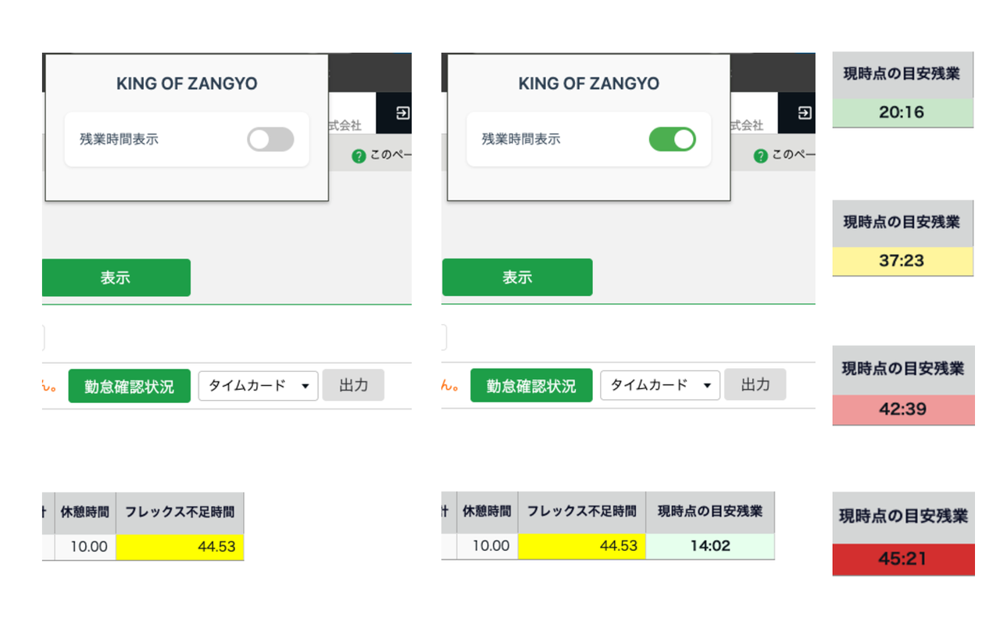

# KING OF ZANGYO

KING OF TIMEの勤怠管理画面に累計残業時間を自動表示するChrome拡張機能です。

## 概要

KING OF TIMEのタイムカード画面を開くと、累計残業時間が自動的に計算されて表示されます。残業時間は色分けされるので、現在の状況を一目で把握できます。

## スクリーンショット



## 機能

### 自動計算
タイムカード画面で累計残業時間を自動計算して表示します。

### 色分け表示
残業時間に応じて4段階で色分けされます。

- 0～30時間：緑
- 30～40時間：黄
- 40～45時間：赤
- 45時間以上：濃赤

### 表示の切り替え
ツールバーの拡張機能アイコンから、表示のON/OFFを切り替えられます。

## インストール

### Chrome Web Storeから

Chrome Web Storeで「KING OF ZANGYO」を検索してインストールしてください。

### 開発版

```bash
git clone https://github.com/[your-username]/King-of-Zangyo.git
```

1. `chrome://extensions/` を開く
2. デベロッパーモードを有効化
3. 「パッケージ化されていない拡張機能を読み込む」をクリック
4. クローンしたフォルダを選択

## 使い方

1. 拡張機能をインストール
2. KING OF TIMEのタイムカード画面を開く
3. 「現時点の目安残業」列が自動的に表示されます

## プライバシー

- 設定情報のみをブラウザ内に保存します
- 勤怠データや個人情報は保存しません
- 外部サーバーへのデータ送信はありません

詳細は [プライバシーポリシー](PRIVACY_POLICY.md) を参照してください。

## 技術情報

- Manifest V3
- Vanilla JavaScript
- 対象ページ: `https://s2.ta.kingoftime.jp/admin/*`

## ライセンス

MIT License

## 免責事項

本拡張機能は非公式ツールであり、KING OF TIME公式とは関係ありません。
