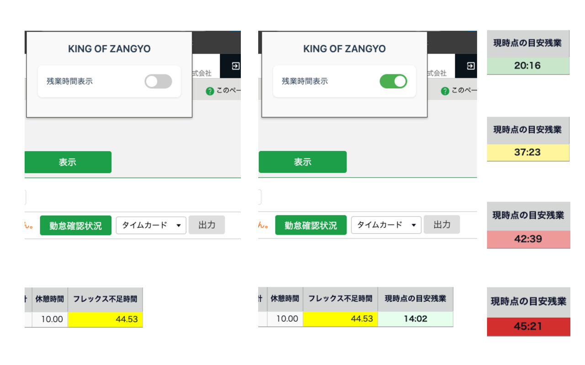

# KING OF ZANGYO

KING OF TIME の勤怠管理画面に累計残業時間・年間残業時間を自動表示する Chrome 拡張機能です。

## 概要

KING OF TIME のタイムカード画面を開くと、累計残業時間と年間残業時間が自動的に計算されて表示されます。残業時間は色分けされるので、現在の状況を一目で把握できます。

## スクリーンショット



## 機能

### 自動計算

タイムカード画面で累計残業時間を自動計算して表示します。
当日分は所定労働時間を超過後に反映されます。

### 年間残業時間の集計

年度別に年間残業時間の合計を集計・表示します。
年度選択で過去の年度データも確認可能です。

### 色分け表示

残業時間に応じて色分け表示で一目で状況を把握できます。

**月間残業時間（5 段階）**

| 色   | 範囲          | 意味         |
| ---- | ------------- | ------------ |
| 緑   | 0 ～ 30 時間  | 安全範囲     |
| 黄   | 30 ～ 40 時間 | 注意         |
| 赤   | 40 ～ 45 時間 | 危険         |
| 濃赤 | 45 ～ 75 時間 | 超過         |
| 紫   | 75 時間以上   | 特別条項超過 |

**年間残業時間（5 段階）**

| 色   | 範囲            | 意味         |
| ---- | --------------- | ------------ |
| 緑   | 0 ～ 300 時間   | 安全範囲     |
| 黄   | 300 ～ 330 時間 | 注意         |
| 赤   | 330 ～ 360 時間 | 危険         |
| 濃赤 | 360 ～ 540 時間 | 超過         |
| 紫   | 540 時間以上    | 特別条項超過 |

### 対応パターン

以下の勤務パターンに対応した残業時間の計算が可能です。
法定休日は計算から除外しています。

- 時間休の残業時間計算
- 半日休暇（AM 有休・PM 有休）の残業時間計算
- 管理職勤務の残業時間計算

### 所定労働時間のカスタマイズ

所定労働時間を 0.5 時間刻みで自由に設定できます（デフォルト：7.5 時間）。

### 年度開始月の設定

会社の年度に合わせて年度開始月を設定可能です（デフォルト：4 月）。

### 表示の切り替え

ツールバーの拡張機能アイコンから、表示の ON/OFF を切り替えられます。

## インストール

### Chrome Web Store から

Chrome Web Store で「KING OF ZANGYO」を検索してインストールしてください。

### 開発者向け

```bash
git clone https://github.com/naopen/king-of-zangyo.git
```

1. `chrome://extensions/` を開く
2. デベロッパーモードを有効化
3. 「パッケージ化されていない拡張機能を読み込む」をクリック
4. クローンしたフォルダを選択

## 使い方

### 基本的な使い方

1. 拡張機能をインストール
2. KING OF TIME のタイムカード画面を開く
3. 「現時点の目安残業」列、「年間残業時間」列が自動的に表示されます

### 設定の変更

1. ブラウザのツールバーにある拡張機能アイコンをクリック
2. 所定労働時間、年度開始月、表示の有無などを設定
3. 設定は自動的に保存され、即座に反映されます

## プライバシー

- 設定情報（表示の ON/OFF、所定労働時間、年度開始月）をブラウザ内に保存します
- 年間残業時間の合計値のみをブラウザ内に保存します（日別・月別の詳細データは保存しません）
- 個人情報や勤怠詳細データ（出退勤時刻等）は一切保存しません
- 外部サーバーへのデータ送信はありません

詳細は [プライバシーポリシー](./store-assets/PRIVACY_POLICY.md) を参照してください。

## 技術情報

- Manifest V3
- Vanilla JavaScript
- 対象ページ: `https://s2.ta.kingoftime.jp/admin/*`

## ライセンス

MIT License

## 免責事項

本拡張機能は非公式ツールであり、KING OF TIME 公式とは一切関係ありません。
